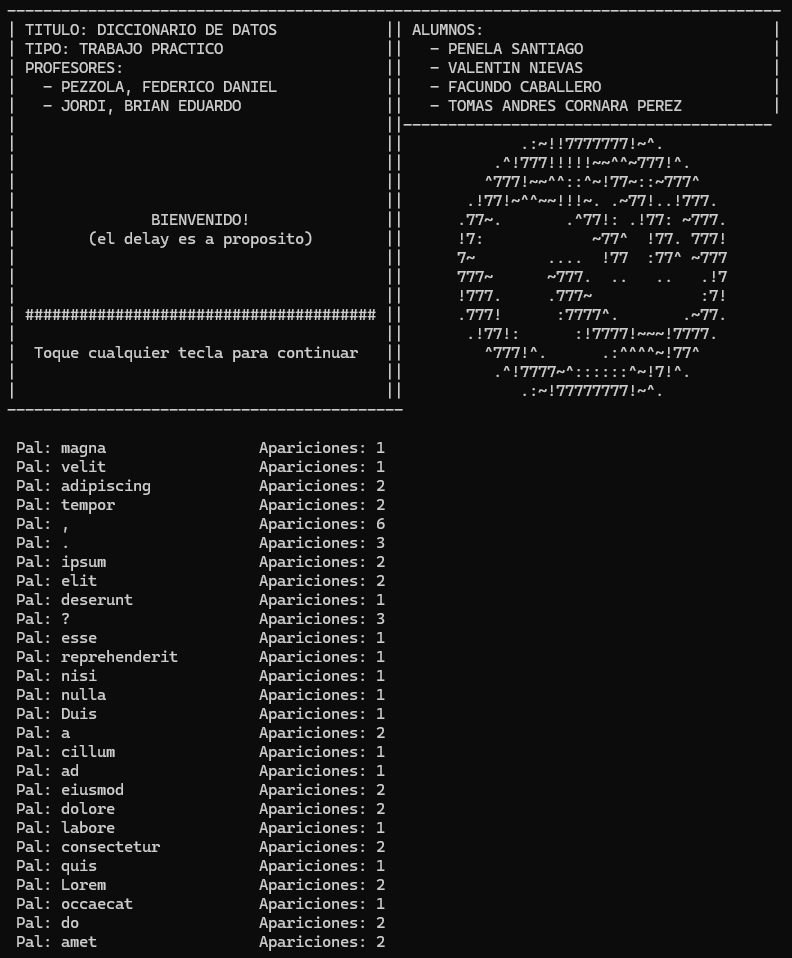

# HashMap - Diccionario de Datos



## Descripción

Este proyecto implementa un **HashMap (Tabla Hash)** en C para crear un diccionario de palabras. El programa lee un archivo de texto, procesa las palabras, maneja signos de puntuación, y cuenta las apariciones de cada palabra usando una estructura de datos eficiente.

## Características

- **HashMap personalizado** con resolución de colisiones mediante listas enlazadas
- **Procesamiento de archivos de texto** con manejo automático de extensiones
- **Separación de signos de puntuación** de las palabras
- **Conteo de frecuencias** de palabras
- **Interfaz visual** con animaciones en consola
- **Gestión de memoria** dinámica

## Compilación y Uso

### Compilación
```bash
gcc -o programa main.c hash_map.c listaDinamica.c parseArchivos.c menu.c -Wall
```

### Ejecución
```bash
./programa archivo.txt
```

El programa acepta archivos con extensión `.txt` o agrega automáticamente la extensión si no se especifica.

## Funcionamiento

1. **Lectura del archivo**: El programa lee palabra por palabra del archivo especificado
2. **Procesamiento**: Separa signos de puntuación de las palabras
3. **Hash**: Calcula el hash de cada palabra/signo usando una función hash personalizada
4. **Almacenamiento**: Guarda en el HashMap con manejo de colisiones
5. **Conteo**: Incrementa el contador de apariciones para palabras duplicadas
6. **Visualización**: Muestra los resultados con una interfaz animada


## Algoritmos Implementados

### Función Hash
- Utiliza el algoritmo **djb2** modificado para strings
- Distribución uniforme en el espacio de 500 buckets
- Manejo eficiente de colisiones

### Resolución de Colisiones
- **Encadenamiento separado** usando listas enlazadas dinámicas
- Inserción ordenada dentro de cada bucket
- Búsqueda eficiente O(1) promedio

## Autores

- **PENELA SANTIAGO**
- **VALENTIN NIEVAS** 
- **FACUNDO CABALLERO**
- **TOMAS ANDRES CORNARA PEREZ**

## Profesores

- **PEZZOLA, FEDERICO DANIEL**
- **JORDI, BRIAN EDUARDO**

---

*Trabajo Práctico - Algoritmos y Estructuras de Datos II - 2025*